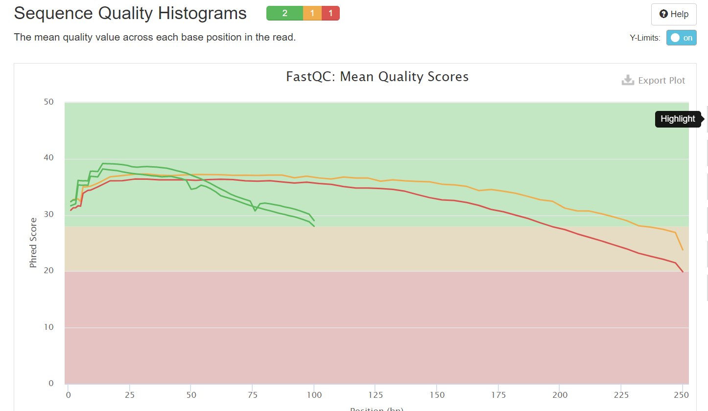

# hse21_hw1
1. Создаем папку hw1 и ссылки на нужные файлы
```
mkdir hw1
cd hw1
ln -s /usr/share/data-minor-bioinf/assembly/oil_R1.fastq
ln -s /usr/share/data-minor-bioinf/assembly/oil_R2.fastq
ln -s /usr/share/data-minor-bioinf/assembly/oilMP_S4_L001_R1_001.fastq
ln -s /usr/share/data-minor-bioinf/assembly/oilMP_S4_L001_R2_001.fastq
```    
2. Делаем случайные чтения 
``` 
seqtk sample -s104 oil_R1.fastq 5000000 > sub_R1.fq
seqtk sample -s104 oil_R2.fastq 5000000 > sub_R2.fq
seqtk sample -s104 oilMP_S4_L001_R1_001.fastq 1500000 > mp_R1.fq
seqtk sample -s104 oilMP_S4_L001_R2_001.fastq 1500000 > mp_R2.fq
``` 
3. Оцениваем качество исходных чтений с помощью fastqc и multiqc
``` 
mkdir fastqc
ls *.fq | xargs -P 4 -tI{} fastqc -o fastqc {}
mkdir multiqc
multiqc -o multiqc fastqc
``` 
4. Подрезаем чтение по качеству и удаляем праймеры 
``` 
platanus_trim sub_R1.fq sub_R2.fq 
platanus_internal_trim mp_R1.fq mp_R2.fq
``` 
5. Удаляем файлы
``` 
rm sub_R1.fq
rm sub_R2.fq
rm mp_R1.fq
rm mp_R2.fq
rm -r oil_R1.fastq
rm -r oil_R2.fastq
rm -r oilMP_S4_L001_R1_001.fastq
rm -r oilMP_S4_L001_R2_001.fastq
``` 
6. Оцениваем качество обрезанных чтений
``` 
mkdir fastqc_trim
mkdir multiqc_trim
ls *fq* | xargs -tI{} fastqc -o fastqc_trim {}
multiqc -o multiqc_trim fastqc_trim
``` 
7. Собираем контиги 
``` 
time platanus assemble -o Poil -f *.trimmed 2> assemble.log
``` 
8. Собираем скаффолды
``` 
time platanus scaffold -o Poil -t 1 -c Poil_contig.fa -IP1 *.trimmed -OP2 *.int_trimmed 2> scaffold.log
``` 
9. Создаем файл с наибольшей длиной
``` 
echo scaffold1_len3833941_cov231 > file.txt
seqtk subseq Poil_scaffold.fa file.txt >longest.fasta
``` 
10. Закрываем гэпы
``` 
time platanus gap_close -o Poil -t 1 -c Poil_scaffold.fa -IP1 *.trimmed -OP2 *.int_trimmed 2>gap_close.log
``` 
11. Удаляем ненужные файлы 
``` 
rm sub_R1.fq.trimmed
rm sub_R2.fq.trimmed
rm mp_R1.fq.int_trimmed
rm mp_R2.fq.int_trimmed
``` 
12. Создаем файл с наибольшей длиной с закрытыми гэпами
``` 
echo scaffold1_len3833941_cov231 > file.txt
seqtk subseq Poil_scaffold.fa file.txt >longest_with_gaps.fasta
``` 
Начальный:

После обрезания:


После обрезания:

После:


Начальный:

После обрезания:


Начальный:

После обрезания:


